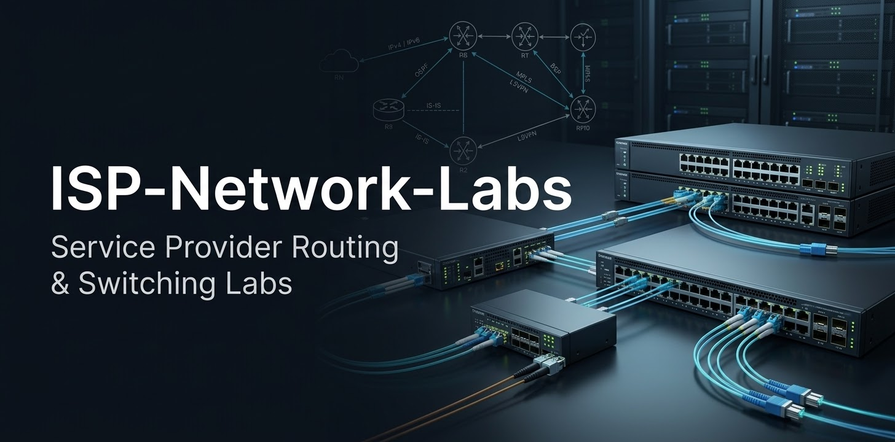

ISP-Network-Labs

Practical Service Provider Networking Labs & Learning Notes

This repository documents a progressive hands-on journey into ISP networking, with a focus on Juniper Junos and Service Provider technologies.

Learning Path

- Junos Fundamentals
- IPv4 & IPv6
- Routing
- OSPF
- IS-IS
- BGP
- Routing Policy
- MPLS
- L3VPN
- High Availability
- Troubleshooting
- Service Provider Network Architecture

Lab Environment

The practical labs are based primarily on Juniper Junos platforms and virtual environments.

Current Focus:
Junos Fundamentals — JNCIS-SP Preparation

Method

Each lab progressively documents:

- Objective
- Topology
- Configuration
- Verification
- Troubleshooting
- Lessons Learned

This repository will evolve progressively as new concepts and technologies are studied.

---

Learn → Build → Test → Troubleshoot → Document
